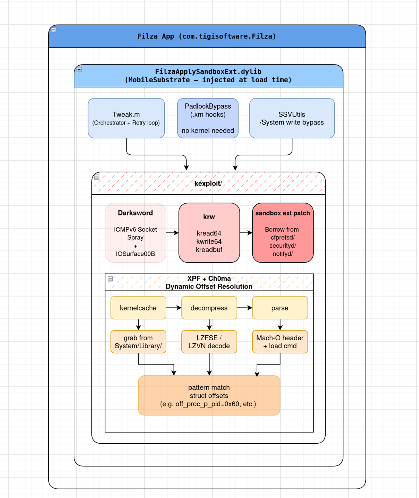

# W0lfSword

**An iOS kernel exploit toolkit. One command takes a jailbroken iPhone from
"locked down" to "full filesystem access inside Filza."**

```
                              __
                            .d$$b
                          .' TO$;\
                         /  : TP._;
                        / _.;  :Tb|
                       /   /   ;j$j
                   _.-"       d$$$$
                 .' ..       d$$$$;
                /  /P'      d$$$$P. |\
               /   "      .d$$$P' |\^"l
             .'           `T$P^"""""  :
         ._.'      _.'                ;
      `-.-".-'-' ._.       _.-"    .-"
    `.-" _____  ._              .-"
   -(.g$$$$$$$b.              .'
     ""^^T$$$P^)            .(:
       _/  -"  /.'         /:/;
    ._.'-'`-'  ")/         /;/;
 `-.-"..--""   " /         /  ;
.-" ..--""        -'          :
..--""--.-"         (\      .-(\
  ..--""              `-\(\/;`
    _.                      :
                            ;`-
                           :\
                           ;
```

---

## What is this?

W0lfSword is a tweak that injects into the **Filza** file manager app and runs a
real kernel exploit (DarkSword) every time Filza opens. Once the exploit wins,
Filza stops being a sandboxed app and becomes a full root file browser.

You control everything from one script on your computer:

```bash
sudo ./W0lfSword adderall
```

That single command finds your phone, builds the tweak, installs it, restarts
Filza, and tells you whether the exploit succeeded.

---

## What can I actually do with it?

After a successful run (you'll see **"SANDBOX ESCAPED"**), open Filza and you can:

| You can… | Example |
|----------|---------|
| **Browse & edit ANY file** on the phone | Read another app's private data, edit plists, replace binaries |
| **Write to protected system folders** | `/System`, `/usr`, `/bin`, `/sbin` — normally sealed read-only |
| **Change ownership & permissions** | `chown` / `chmod` any file, even system files |
| **Hide or unhide files** | Make files invisible to the filesystem listing |
| **Bypass Filza's restrictions** | Delete/edit without padlocks, no license nag screens, no root-helper app |
| **Zip/unzip anything** | Archive and extract to any path |

## What it does NOT do

Be clear on the limits — this saves confusion:

- ❌ **It does not sideload Filza.** Filza must already be installed on the phone
  (TrollStore, Sileo, Cydia — your choice). W0lfSword only installs the tweak.
- ❌ **It is not a full jailbreak.** No Cydia/Sileo, no system-wide code signing
  changes, no untethered persistence. It's kernel read/write while Filza runs.
- ❌ **Nothing is permanent.** Reboot the phone and everything resets. The
  exploit simply runs again the next time you open Filza.
- ❌ **It won't work on iPhone 17 / M5.** Apple added MTE (Memory Tagging
  Extension), which blocks this exploit class.

---

## What you need before starting

1. **A jailbroken iPhone** (Dopamine, palera1n, etc.) with MobileSubstrate —
   iOS 17.0–26.0.1, A10–A18 Pro, M1–M4
2. **Filza already installed** on that phone
3. **OpenSSH** running on the phone (reachable over WiFi as `root`)
4. **Build tools on your computer** — one command installs them:
   `sudo ./W0lfSword setup`

---

## Quick start

```bash
git clone https://github.com/kaffeindecaf/W0lfSword.git
cd W0lfSword

sudo ./W0lfSword setup            # 1. Install build tools (one time)
sudo ./W0lfSword adderall         # 2. Auto-discover → build → deploy → verify

# Shorter manual path:
./W0lfSword build                 # Compile the tweak
./W0lfSword deploy 192.168.1.5    # Install on the phone (use your phone's IP)
```

> **`adderall` is the recommended command.** It auto-discovers your device via
> USB or WiFi, checks that your iOS version has offsets, builds, deploys, and
> verifies the exploit — all in one go.
>
> | Variant | Purpose |
> |---------|---------|
> | `sudo ./W0lfSword adderall` | Full run with prompts |
> | `sudo ./W0lfSword adderall --yes` | Skip all prompts |
> | `sudo ./W0lfSword adderall --safe` | Safe mode: UI hooks only, no kernel exploit |

**New to this?** Run `sudo ./W0lfSword adderall --safe` first. It installs
everything but skips the risky part, so you can confirm the setup works before
running the real exploit.

After success, open Filza — the exploit runs automatically within 1–2 seconds.

---

## Features

| Feature | Plain English |
|---------|---------------|
| **Kernel exploit** | DarkSword (ICMPv6 socket spray + IOSurface OOB) → kernel read/write |
| **Retry loop** | Up to 5 attempts with backoff — first-try failures are normal |
| **Sandbox escape** | Patches the kernel's sandbox rules for Filza to allow `"/"` access |
| **SSV bypass** | Redirects file pointers so `/System`, `/usr`, `/bin` become writable |
| **Root ownership** | Files you create in system paths get `root:wheel` automatically |
| **Root helper bypass** | Intercepts Filza's XPC calls — no helper app needed |
| **License bypass** | Suppresses "binary modified" and activation alerts |
| **Padlock bypass** | Always allows edit/delete, skips confirmation dialogs |
| **Zip/unzip** | Uses Filza's built-in minizip through a validated pointer table |
| **Kill switch** | `touch /var/mobile/Documents/.filza_tweak_disable` disables the tweak without uninstalling |
| **Logging** | Everything in `/tmp/FilzaTweak.log` (4MB rotation) — fetch with `./W0lfSword log` |

---

## Supported devices

| iOS Version | A12–A14 | A15 | A16 | A17 | A18 | M1–M4 |
|-------------|---------|-----|-----|-----|-----|-------|
| 17.0–17.7   | ✓ | ✓ | ✓ | ✓ | — | ✓ |
| 18.0–18.7.7 | ✓ | ✓ | ✓ | ✓ | ✓ | ✓ |
| 26.0–26.0.1 | ✓ | ✓ | ✓ | ✓ | ✓ | ✓ |

**Not supported:** iPhone 17 (A19), iPad M5 — Apple's MTE blocks kernel R/W.

---

## Commands

Run `./W0lfSword` with no arguments for the interactive menu, or use commands
directly. Shortcuts: `b`=build, `d`=deploy, `a`=adderall, `s`=status, `l`=log.

| Command | What it does | Example |
|---------|--------------|---------|
| `adderall` | Everything: discover → build → deploy → verify `[needs sudo]` | `sudo ./W0lfSword adderall` |
| `quick` | One-shot build → deploy → verify | `./W0lfSword quick` |
| `build` | Compile the tweak into a .deb | `./W0lfSword build` |
| `deploy <ip>` | Install the .deb on the phone | `./W0lfSword deploy 192.168.1.5` |
| `safe on\|off` | Enable/disable safe mode (UI hooks only, no kernel writes) | `./W0lfSword safe on` |
| `toggle on\|off` | Enable/disable the tweak remotely | `./W0lfSword toggle off` |
| `log [n]` | Fetch the phone's tweak log | `./W0lfSword log 100` |
| `monitor` | Live color-coded log tail | `./W0lfSword monitor` |
| `doctor` | Check your computer's build environment | `./W0lfSword doctor` |
| `status` | Project health overview | `./W0lfSword status` |
| `offsets [ver]` | Show iOS version offset coverage | `./W0lfSword offsets 26.0` |
| `device add\|list\|switch\|info` | Manage multiple phones | `./W0lfSword device add 192.168.1.5` |
| `profile save\|load\|list` | Save/load deploy configurations | `./W0lfSword profile save my-ip14` |
| `history [stats]` | Exploit success/fail history | `./W0lfSword history stats` |
| `reboot [ip]` | Reboot the phone over SSH | `./W0lfSword reboot` |
| `crashlog` | View the last crash-monitor log | `./W0lfSword crashlog` |
| `setup` | Install build tools on your computer `[needs sudo]` | `sudo ./W0lfSword setup` |
| `usbliter8` | CFW builder · PWN DFU · A12/A13 restore `[needs sudo]` | `sudo ./W0lfSword ul8` |
| `clean` / `update` / `audit` / `export` | Housekeeping & diagnostics | `./W0lfSword update` |
| `help` | Full list with requirements | `./W0lfSword help` |

**Color-coded logs:** green = success, red = errors, yellow = retries, cyan = structure, dim = details.

Data (devices, profiles, history) is stored in `.w0lfsword/` — gitignored.

---

## What gets installed on the phone

The .deb places two files and nothing else:

```
/Library/MobileSubstrate/DynamicLibraries/
├── FilzaApplySandboxExt.dylib     # The compiled tweak (~540KB, arm64)
└── FilzaApplySandboxExt.plist     # Filter: inject only into Filza
```

The tweak injects into `com.tigisoftware.Filza` (and `com.tigisoftware.Filza000`
for Filza 4.0.2) via MobileSubstrate. Restart Filza and the exploit runs.

---

## How it works (the short version)

```
Filza opens
  → tweak loads, hooks installed (padlock/license/zip bypasses active immediately)
  → after 1s: kernel exploit attempt (socket spray + OOB race → kernel R/W)
  → sandbox escape (patch kernel sandbox rules to "/")
  → SSV activation (sealed system volume becomes writable)
  → done: full root filesystem access inside Filza
```

On failure it retries up to 5 times with backoff, then gives up quietly —
Filza still works normally, just without the exploit.




---

## Troubleshooting

### "ESCAPE NOT CONFIRMED" after adderall

1. `./W0lfSword offsets <your iOS version>` — is your version covered?
2. `./W0lfSword log 100` — read the actual failure
3. Try again — the retry loop exists because attempts 1–2 often fail

### Build issues

| Symptom | Fix |
|---------|-----|
| `theos/makefiles/common.mk: No such file` | `export THEOS=~/theos` |
| `iPhoneOS.sdk not found` | Download SDK from [theos/sdks](https://github.com/theos/sdks) into `$THEOS/sdks/` |
| `dpkg-deb: command not found` | `brew install dpkg` / `sudo apt install dpkg` |
| `clang: error: no such file: 'XPF/src/xpf.c'` | `git submodule update --init` |

### Device issues

| Symptom | Fix |
|---------|-----|
| Filza crashes on launch | Kernel panicked on a previous run — reboot the phone, retry |
| `ssh: connect refused` | Install OpenSSH on the phone (Sileo/Cydia) |
| `Permission denied (publickey)` | `ssh -o StrictHostKeyChecking=no root@<phone-ip>` once |
| Tweak does nothing | Kill-switch flag active — `./W0lfSword toggle off` |
| Files look writable but writes fail | SSV didn't activate — check log for `ensureSSVActive set active=1` |
| Filza 4.0.2 crashes | Bundle ID mismatch — `adderall` picks the correct target automatically |

---

## For developers

### Project layout

```
W0lfSword                        # CLI: interactive menu, build, deploy, diagnostics
├── Tweak.m                      # Main orchestrator (hooks + exploit driver)
├── sandbox_escape.m             # Sandbox escape via kernel extension patching
├── FilzaPadlockBypass.xm        # Filza UI padlock bypass (Logos hooks)
├── kexploit/                    # DarkSword exploit engine (32 files)
├── SSV/                         # Signed System Volume bypass
├── utils/                       # Logging, permissions, file hide/reveal
├── kpf/ + XPF/                  # Kernelcache grabber + offset patchfinder
├── research/                    # Reverse-engineered sandbox structs
└── docs/                        # Guides & checklists
```

### Build it yourself

```bash
sudo ./W0lfSword setup   # THEOS + dependencies (or see BUILD.md for manual steps)
make package             # Full build + .deb
make package FINALPACKAGE=1   # Release (strips debug symbols)
```

### Adding a new iOS version

1. Grab the kernelcache from the target device
2. Run XPF on it to resolve new offsets
3. Add a `SYSTEM_VERSION_GREATER_THAN_OR_EQUAL_TO` block in `kexploit/offsets.m`
4. Test on real hardware, submit a PR

Before committing: `./W0lfSword audit` and `./W0lfSword status`.

---

## Credits

| Person | Contribution |
|--------|--------------|
| [Huy Nguyen](https://github.com/34306/) | Original FilzaJailedDS project |
| [wh1te4ever](https://github.com/wh1te4ever/) | DarkSword exploit & XPF offset engine |
| [opa334](https://github.com/opa334/) | XPF patchfinder, krw primitives, sandbox structures |
| [khanhduytran0](https://github.com/khanhduytran0/) | Sandbox hook token technique |
| [CrazyMind90](https://github.com/crazymind90/) | Sandbox token acquisition via kernel R/W |
| [XEmaz](https://x.com/XEmaz_) | SSV bypass, root chown, padlock/license bypass, zip hooks |
| [kaffeindecaf](https://github.com/kaffeindecaf/) | iOS 26.0.1 stability, retry logic, threading, logging, tooling |

Informed by [felix-pb/kfd](https://github.com/felix-pb/kfd),
[opa334/TrollStore](https://github.com/opa334/TrollStore),
[opa334/opainject](https://github.com/opa334/opainject).

---

## Reference library (`referenceforAI/`)

A curated knowledge base of 19 third-party projects, indexed in
[`referenceforAI/RESEARCH.md`](referenceforAI/RESEARCH.md), plus active
research docs. Highlights:

| Area | Projects |
|------|----------|
| **Core exploit chains** | `darksword-kexploit`, `DarkSword-RCE` (WebKit→kernel), `excalibur` (GUI + remote ROP), `kfd` (PUAF), `xnu_1day_practice` (14 XNU CVE PoCs with analyses) |
| **WebKit / zero-click** | Coruna exploit kit (CVE-2024-23222), Glass Cage (CVE-2025-24085/24201/43300 PNG chain) |
| **ImageIO exploitation** | `CVE-2025-43300-hunters` (DNG 0-click PoC + analyzer), `CVE-2025-43300-PwnToday` (root-cause writeup), `zero-click-exploit-analysis` (CVE-2025-55177 paper + labs), `CVE-2023-41064` (BLASTPASS) |
| **Sandbox escapes** | `bad_query` (containermanagerd traversal, iOS 26-27), `FilzaSlop` (MCM/MobileHouseArrest container access, iOS 18/26/27b — ported into `kexploit/mcm_bridge.m` + `kexploit/container_access.m`) |
| **Bootchain / jailbreaks** | `usbliter8-fun`, `usbliter8-fun2` (iOS 27) |
| **Tweak tooling** | `iDevice-Toolkit` (CVE-2025-24203), `Mugunghwa` (theming), `opainject`, `TrollStore` |

Key research docs:

- **[`referenceforAI/SandboxEscape.md`](referenceforAI/SandboxEscape.md)** — active
  research hub: finding a new sandbox escape for iOS 26.1, led by the ImageIO
  memory-corruption angle (CVE-2025-43300 family)
- **`referenceforAI/docs/researchdeepseek.md`** — 31 bug bounty findings + exploit architecture deep dives
- **`referenceforAI/skills/`** — 4 AI-agent skill files (kernel exploit, sandbox escape, pentesting, tooling)

---

## More docs

| File | Purpose |
|------|---------|
| `CONTEXT.md` | Full project knowledge base — start here when resuming a session |
| `ROADMAP.md` | 203-item checklist: bugs, features, exploits, tweak menu, sandbox research |
| `referenceforAI/RESEARCH.md` | Index of all 19 reference projects (techniques matrix, CVE notes) |
| `referenceforAI/SandboxEscape.md` | iOS 26.1 sandbox escape research hub (ImageIO angle) |
| `BUG_BOUNTY.md` | 14 security findings with Apple bounty ranges |
| `AUDIT_REPORT.md` | 20 findings ranked CRITICAL→LOW, fixes applied |
| `DEBUG_TRACKING.md` | Every log statement mapped by file:line |
| `BUILD.md` | Theos explanation, prerequisites, build troubleshooting |

---

## License & warning

Incorporates code from DarkSword (wh1te4ever), XPF/ChOma (opa334) — all original
code remains under its respective authors' licenses. The integration layer and
tooling are released as-is for research and testing.

**WARNING:** This is a pre-release testing build. Modifying system files can
render your device unbootable — use at your own risk.
