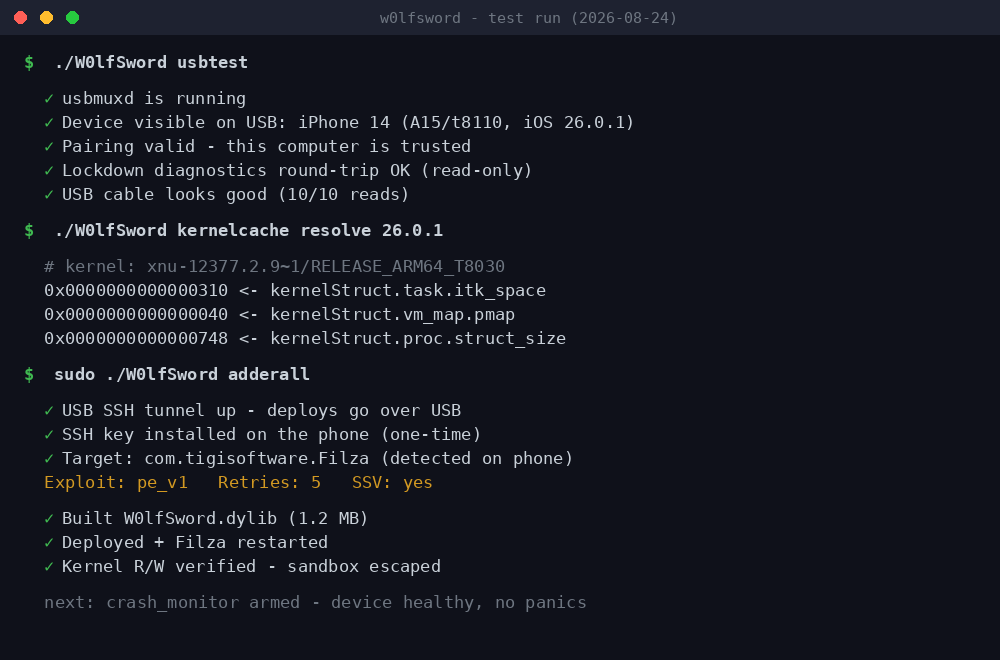

# W0lfSword

[](https://github.com/kaffeindecaf/W0lfSword/stargazers)
[](LICENSE)
[](https://github.com/kaffeindecaf/W0lfSword)
[](https://github.com/kaffeindecaf/W0lfSword)
[](https://github.com/kaffeindecaf/W0lfSword)

W0lfSword is a kernel exploit toolkit for iOS. One command turns a
jailbroken iPhone with Filza into a full root file browser. The same
repo holds host-side tools that pull kernel offsets from any iOS build
on your computer, no device needed.

Current release: v1.4.0

## Quick start

```bash
git clone https://github.com/kaffeindecaf/W0lfSword.git
cd W0lfSword

./W0lfSword setup              # build tools, one time
sudo ./W0lfSword adderall      # everything else
```

`adderall` does the whole run: finds the phone over USB or WiFi, installs
any missing build tools, checks the device model and iOS version against
the exploit compatibility matrix (refusing MTE and unsupported SoCs before
anything is built), generates its own SSH key, builds the tweak, deploys
it, restarts Filza, and reports whether the exploit won. The only times it
needs you are the TRUST prompt on the phone and the Filza version question.

- `sudo ./W0lfSword adderall --safe` ... UI hooks only, skips the kernel
  part. Run this first if it's your first time.
- `sudo ./W0lfSword adderall --yes` ... skip the remaining prompts.

After a successful run, open Filza. The exploit fires within a second or two.

## The tweak

It injects into Filza and runs DarkSword (CVE-2025-43520, an ICMPv6
socket spray + IOSurface OOB) every time Filza opens. When the exploit
wins, Filza stops being a sandboxed app. `/System`, `/usr`, `/bin` and
other apps' containers become readable and writable from the normal
file browser UI.

```
Filza opens
  -> tweak loads, UI hooks active immediately (padlock/license/zip)
  -> 1s later: socket spray + OOB race -> kernel R/W
  -> sandbox rules patched to "/"
  -> sealed system volume made writable
  -> full root access inside Filza
```

If the race loses, it retries up to 5 times, then gives up quietly.
Filza keeps working, just without the exploit.

What that means in Filza:

- full filesystem access, including the sealed system volume
- chown/chmod on anything, hide/unhide files
- padlocks and license screens gone
- zip/unzip anywhere
- resets on reboot; open Filza again and it's back


## Host tools (no phone needed)

The `kernelcache` and `panic` commands plus the XPF resolver do kernel
offset work on your computer: resolve a kernelcache's struct offsets,
diff two iOS builds to see what changed (syscalls added, structs
resized, SPTM status), extract a kernelcache from an IPSW, and classify
crash logs. This is the part that caught a wrong `itk_space` offset in
the repo's own table.



<details>
<summary><b>howl (ascii art)</b></summary>

```text
                              __
                            .d$$b
                          .' TO$;\
                         /  : TP._;
                        / _.;  :Tb|
                       /   /   ;j$j
                   _.-"       d$$$$
                 .' ..       d$$$$;
                /  /P'      d$$$$P. |\
               /   "      .d$$$P' |\^"l
             .'           `T$P^"""""  :
         ._.'      _.'                ;
      `-.-".-'-' ._.       _.-"    .-"
    `.-" _____  ._              .-"
   -(.g$$$$$$$b.              .'
     ""^^T$$$P^)            .(:
       _/  -"  /.'         /:/;
    ._.'-'`-'  ")/         /;/;
 `-.-"..--""   " /         /  ;
.-" ..--""        -'          :
..--""--.-"         (\      .-(\
  ..--""              `-\(\\/;`
    _.                      :
                            ;`-
                           :\
                           ;
```

</details>

## What it doesn't do

- It does not install Filza. You need Filza on the phone already
  (TrollStore, Sileo, Cydia, whatever).
- It is not a jailbreak. No Cydia, no code-signing changes, nothing
  persistent. Kernel read/write exists only while Filza runs.
- It does not work on iPhone 17 (A19) or M5 iPads. Apple moved those
  to MTE (Memory Tagging Extension), which kills this exploit class.

## Requirements

- A jailbroken iPhone on iOS 17.0–26.0.1 (A10–A18 Pro, M1–M4) with
  MobileSubstrate
- Filza installed
- OpenSSH on the phone (WiFi, root login)
- Build tools on your computer: `./W0lfSword setup` (no sudo on macOS,
  `sudo` on Linux)

macOS 13+ works out of the box. Xcode Command Line Tools provide clang and
the iPhoneOS SDK, Homebrew provides dpkg and libimobiledevice, Theos goes
to `/opt/theos`. Run `setup` without sudo on a Mac, Homebrew refuses to run
as root. See BUILD.md for the details.

## Known issues

- iOS 26.1 and newer: the kernel stage is capped (DarkSword was patched in
  26.1). The userspace modules still work there, specifically MCM container
  access (`mha`) and the bad_query read-escape. The script prints exactly
  what's available for your iOS version after it detects the device.
  (26.1+ research is post-v1.0, see the ROADMAP.)
- The padlock bypass hooks Filza's UI classes. If a Filza update renames
  them, some padlocks come back until the hooks are updated. The exploit,
  sandbox escape and SSV writes are unaffected.
- SSV writes race the kernel and can fail on the first try under memory
  pressure. The tweak retries automatically; occasionally you have to tap
  the operation again.
- The exploit is a race. It usually wins, but up to 5 attempts run per
  Filza launch. If the phone kernel-panics 3 launches in a row, the tweak
  disables itself (`/var/mobile/Documents/.filza_tweak_disable`; delete the
  file to re-enable).
- Kernel panics are possible. This is a kernel exploit. A panic means a
  reboot, not data loss, but don't run it on a phone you can't reboot.

## Commands

Run `./W0lfSword` bare for the interactive menu. Shortcuts: `b` build,
`d` deploy, `a` adderall, `u` usbtest, `p` panic, `k` kernelcache,
`s` status, `l` log.

| Command | Does | Example |
|---------|------|---------|
| `adderall` | discover -> build -> deploy -> verify (needs sudo). USB SSH preferred when the phone is plugged in | `sudo ./W0lfSword adderall` |
| `adderall --usb` | force USB-only transport (fails if no USB device/sshd) | `sudo ./W0lfSword adderall --usb` |
| `adderall --force-jb` | compile the helper-mode bypass in: run the kernel race on a jailbroken kernel (test beds where AFC writes are denied) | `sudo ./W0lfSword adderall --force-jb` |
| `adderall --test` | compile the main-device safety ladder (readonly default) into the build | `sudo ./W0lfSword adderall --test` |
| `readiness (r)` | full device report, no SSH needed: USB identity, tweak/app state from the on-device log (spray, PCB, corruption, escape), builds, release assets, offset coverage, kcwatch verdict | `./W0lfSword r` |
| `nojailbreak (nj)` | USB-only Filza install with kernel R/W, no jailbreak. `--ipa <path>` for the Filza source, `--test` for the safety ladder | `sudo ./W0lfSword nj --test` |
| `quick` | one-shot build -> deploy -> verify | `./W0lfSword quick` |
| `build` | compile the tweak into a .deb | `./W0lfSword build` |
| `deploy <ip>` | install the .deb on the phone | `./W0lfSword deploy 192.168.1.5` |
| `safe on\|off` | UI hooks only, no kernel writes | `./W0lfSword safe on` |
| `toggle on\|off` | enable/disable the tweak remotely | `./W0lfSword toggle off` |
| `log [n]` | pull the phone's tweak log | `./W0lfSword log 100` |
| `monitor` | live color-coded log tail | `./W0lfSword monitor` |
| `doctor` | check your build environment | `./W0lfSword doctor` |
| `status` | project health overview | `./W0lfSword status` |
| `offsets [ver]` | offset coverage per iOS version | `./W0lfSword offsets 26.0` |
| `exploits` | technique matrix: what works on your device (K1.5) | `./W0lfSword exploits` |
| `chains [a-g\|best]` | attack chain catalog with stages; `chains best` auto-selects for the connected device (K5.9) | `./W0lfSword chains best` |
| `mobilegestalt (mg)` | full MobileGestalt editing (Chain F): list/set/unset/dump/apply/backup/restore/respring — USB/AFC into Filza Arctic (non-JB) or `--ssh <ip>` (jailbroken); kernel-route write via the escaped Filza process, iOS 17–26.0.1 | `./W0lfSword mobilegestalt set dynamic-island 1 --respring` |
| `sbtweak (sbt)` | SpringBoard live tweaks via TaskRop RemoteCall: `dock <1-12>` (5-icon dock) | `reset` | `status` — live SB object edits, revert on reboot, iOS 17–26.0.1 (on-device verify pending) | `./W0lfSword sbtweak dock 5` |
| `cve [filter]` | CVE tracker: kernel / userspace / sandbox / tcc / ssv / live (C5.1/C5.2) | `./W0lfSword cve live` |
| `poclab list` | PoC lab: found-but-unimplemented bugs with status (tested / blocked / needs-device) | `./W0lfSword poclab list` |
| `poclab test <id>` | run a host-side PoC: `alac` (ASAN ALAC harnesses), `libxml2-diff` (fork comparison) | `./W0lfSword poclab test alac` |
| `experimental` | dev section (red theme): unfinished exploits, novel chains, verbose device dump | `./W0lfSword experimental list` |
| `poc list` | panic-PoC catalog (research only, crashes the phone) | `./W0lfSword poc list` |
| `poc sep-panic [ip]` | build + deploy + fire the SEP panic PoC | `./W0lfSword poc sep-panic` |
| `poc exr [ip]` | deploy the CVE-2026-28990 EXR ImageIO trigger | `./W0lfSword poc exr` |
| `fuzz [cmd]` | ImageIO fuzz harness: mutate -> push -> open/probe -> crash capture (K4.2, K4.13) | `./W0lfSword fuzz probe --device 192.168.1.5` |
| `kcwatch` | auto kernel-delta watcher: poll -> ranged-fetch -> XPF -> report + offsets.m verdict | `./W0lfSword kcwatch poll --board t8030` |
| `mha <ipa>` | Re-sign Filza as MobileHouseArrest -> pre-exploit container access (K4.12) | `./W0lfSword mha Filza.ipa` |
| `tweaks [install <id>]` | SpringBoard tweak catalog + installer | `./W0lfSword tweaks install five_icon_dock` |
| `device add\|list\|switch\|info` | manage multiple phones | `./W0lfSword device add 192.168.1.5` |
| `profile save\|load\|list` | deploy configurations | `./W0lfSword profile save my-ip14` |
| `history [stats]` | exploit success/fail history | `./W0lfSword history stats` |
| `reboot [ip]` | reboot the phone over SSH | `./W0lfSword reboot` |
| `crashlog` | last crash-monitor log | `./W0lfSword crashlog` |
| `setup` | install build tools (needs sudo on Linux) | `sudo ./W0lfSword setup` |
| `usbliter8` | A12/A13 tethered jailbreak TUI (needs sudo) | `sudo ./W0lfSword ul8` |
| `usbtest (u)` | USB cable + pairing + data round-trip. Harmless, read-only | `./W0lfSword usbtest` |
| `panic` | classify .ips crash logs -> kernel/SEP/MTE + known CVEs | `./W0lfSword panic analyze crash.ips` |
| `kernelcache` | offline XPF offset research: resolve / diff / extract (K4.1 as a command) | `./W0lfSword kernelcache diff a.img4 b.img4` |
| `status/offsets/audit --json` | machine-readable output for scripts and CI | `./W0lfSword status --json` |
| `clean` / `update` / `audit` / `export` | housekeeping and diagnostics | `./W0lfSword update` |
| `help` | full list with requirements | `./W0lfSword help` |

Log colors: green success, red errors, yellow retries, cyan structure, dim
details. Devices, profiles and history live in `.w0lfsword/` (gitignored).

Menu behavior (animations, colors, wolf art, prompt) is configurable:
`.w0lfsword/config` - a plain key=value file, or `./W0lfSword config` to
view/change it from the CLI (`config set <key> <value>`, `config edit`,
`config reset`). Keys: animations, anim_speed, show_wolf, menu_compact,
device_scan, color, confirm_risky, prompt_symbol, loading_time, report_errors.

The interactive menu opens with a short loading animation: the wolf's
own characters scramble (with a small spinner + "loading..."), settle
into the real art, then the menu text materializes below it with the
same scramble cascade (dim → frost → real colors, top to bottom, faster
per line than the wolf). The experimental tab uses the same red-wolf
scramble + text reveal. Set show_wolf=loading to hide the wolf from the
menu (boot animation only), show_wolf=never to drop it entirely, or
animations=off for a plain instant menu. color=off strips ANSI codes
for logs.

## Features

| What | How |
|------|-----|
| Kernel exploit | DarkSword: ICMPv6 socket spray + IOSurface physical OOB -> kernel R/W |
| Retries | Up to 5 attempts with backoff; first-try failures are normal |
| Sandbox escape | Patches Filza's kernel sandbox rules to `/` |
| SSV bypass | vnode redirection makes `/System`, `/usr`, `/bin` writable |
| Root ownership | New files in system paths get `root:wheel`. Filza itself runs as root via the posix_cred patch after escape (K4.13) |
| Root helper bypass | Filza's XPC calls intercepted, no helper app |
| License bypass | "Binary modified" / activation alerts suppressed |
| Padlock bypass | Edit/delete always allowed, confirmation dialogs skipped |
| Zip/unzip | Via Filza's own minizip, function pointers validated |
| Userspace read escape | bad_query containermanagerd traversal (26.0–26.6.1) + MCM bridge. Container reads work even before the kernel exploit (K4.10/K4.11) |
| On-screen HUD | collapsible status panel in Filza: exploit state + device/iOS line, live log, LOG button (exports the log to Documents/w0lfsword-log.txt for sharing), RERUN button (fresh exploit attempt without relaunching) |
| Safety ladder | release builds default to STAGED auto: readonly compatibility check → light krw write probe → full chain only if both pass; a failed stage is a final verdict with the device left clean (status 6, no retries). Test builds default to READONLY (zero kernel writes). Switch modes on-device via Documents/w0lf_test_mode: (absent)=staged, 1=readonly, 2=writetest, 3=full immediate |
| Failure cleanup | on the final give-up the tweak removes everything it created (SSV diag files, /var/lib/filza, thousands of spray sockets) so a failed run leaves the device clean |
| Unsupported-iOS gate | outside 17.0–26.0.1 the tweak goes quiet (status 5, no probes, no writes); a staged incompatibility (bad offsets / wrong device) stops at status 6; jailbroken devices still get helper mode so the browser works |
| Kill switch | `touch /var/mobile/Documents/.filza_tweak_disable` |
| Logging | Everything in `/tmp/FilzaTweak.log` (4MB rotation) + Documents/FilzaTweak.log + os_log. Export via the HUD LOG button or pull over USB |

## Supported devices

| iOS | A12–A14 | A15 | A16 | A17 | A18 | M1–M4 |
|-----|---------|-----|-----|-----|-----|-------|
| 17.0–17.7 | yes | yes | yes | yes | no | yes |
| 18.0–18.7.7 | yes | yes | yes | yes | yes | yes |
| 26.0–26.0.1 | yes | yes | yes | yes | yes | yes |

Not supported: iPhone 17 (A19), M5 iPads. MTE blocks kernel R/W there.

## What gets installed on the phone

Two files, nothing else:

```
/Library/MobileSubstrate/DynamicLibraries/
+-- FilzaApplySandboxExt.dylib     # the tweak (arm64)
+-- FilzaApplySandboxExt.plist     # inject only into Filza
```

It injects into `com.tigisoftware.Filza` and `com.tigisoftware.Filza000`
(Filza 4.0.2). Restart Filza and the exploit runs.

## Releases

One asset per release on the GitHub releases page. The sideload builds:

- `FilzaArctic.ipa` - release build, display name "Filza Arctic", original
  Filza icons. Full chain, cleans up after itself on failure.
- `FilzaArctic-Test.ipa` - same thing with the safety ladder compiled in.
  Defaults to READONLY on the device (zero kernel writes) until you write
  a mode into Documents/w0lf_test_mode: 1 readonly, 2 writetest, 3 full.
- `FilzaArctic-JBtest.ipa` - test-bed build with the jailbreak force
  override (runs the kernel race on a jailbroken kernel).

The `mha` / `nojailbreak` commands build these from your own Filza.ipa.
The kernel offset tables are verified per build with XPF (see
`experimental offsets <ipsw-url>`).

Bundle IDs: the GitHub release asset keeps the MobileHouseArrest identity
for TrollStore installs. For Apple-ID sideloading (PlumeImpactor /
AltStore) build with `BUNDLE_ID=com.kaffeindecaf.w0lfsword.filza` (or run
`./W0lfSword nojailbreak`, which passes it automatically) — Apple's
developer portal rejects every com.apple.* identifier with API error
9400, including the sharing extension, so the MHA identity can never be
registered through a sideloader.

<details>
<summary><b>What's new in v1.4.0</b></summary>

- Main-device safety ladder. Test builds default to READONLY: spray,
  race, and OOB scan validate the filt/gencnt offsets and the 26.x
  kernel base magic on-device, then stop before any corruption. Mode 2
  (writetest) corrupts one socket, probes kernel reads, restores the
  original pointer, and verifies. Mode 3 is the full chain. Switched
  per-launch via Documents/w0lf_test_mode.
- HUD got device/iOS line, LOG export button (writes the live log into
  Documents/w0lfsword-log.txt so anyone can share it), and RERUN (fresh
  exploit attempt without relaunching; attempt counter resets).
- Failure cleanup: on the final give-up the tweak removes its leftovers
  (SSV diag files, /var/lib/filza, spray sockets) and leaves the device
  clean. A failed run leaves Filza in stock sandboxed mode, not broken.
- Unsupported iOS goes quiet: outside 17.0-26.0.1 the tweak shows
  status 5 and does nothing; jailbroken devices still get helper mode.
- `readiness (r)` command: full device report with no SSH - USB
  identity, app/tweak state pulled from the on-device log over AFC
  (spray health, PCB found, corruption, escape), builds, release
  assets, offset coverage, kcwatch verdict.
- `adderall --force-jb` (jailbroken-kernel test beds), `adderall --test`,
  `nojailbreak --test`, post-install readiness check after nojailbreak,
  adderall resets the on-device crash counter after a win.
- `experimental testipa` (build the safety-ladder IPA) and
  `experimental offsets <ipsw-url>` (fetch a kernelcache + XPF-resolve
  the chain offsets against offsets.m).
- 26.0.1 (23A355) t8110 offsets XPF-verified; p_name fixed (0x57d ->
  0x6A0, per-build in 26.x). Kernel base magic for 26.x byte-verified.
- fsnode sanity guard fixed (it compared file-type bits against a
  permission mask and never passed), failed best-effort kwrites no
  longer spam FATAL, and the SSV diag errno only reports on failure.

</details>

<details>
<summary><b>What's new in v1.3.0</b></summary>

- Critical errors (build/deploy/audit/adderall failures) now write a full
  verbose report to `.w0lfsword/reports/crash-<ts>.txt` - version, git
  commit, command line, OS, config, device, session-log tail - then ask
  whether to file it as a GitHub issue. Answer yes and it's sent via the
  gh CLI (github.com/kaffeindecaf/W0lfSword), no copy-pasting needed.
- `report` command: `report list` shows saved reports, `report <file>`
  files one later.
- Config key `report_errors`: `ask` (prompt, default), `on` (auto-file),
  `off` (save locally only). Never prompts in --json or piped output.

</details>

<details>
<summary><b>What's new in v1.2.0</b></summary>

- Loading screen: the interactive menu opens with the wolf's own
  characters scrambling (small spinner + "loading..." above), then
  settling into the real art - the menu text then materializes below
  with the same scramble cascade (dim → frost → real colors), and the
  experimental tab got the same red-wolf scramble + text reveal. The
  experimental menu entry moved to the bottom of the research group,
  tagged [beta].
- `config` command + `.w0lfsword/config` file: animations (on/off),
  anim_speed (fast/normal/slow), show_wolf (loading/menu/never),
  menu_compact (on/off), device_scan (on/off), color (on/off),
  confirm_risky (on/off), prompt_symbol (text), loading_time (seconds).
  Change it by hand or via `./W0lfSword config set <key> <value>`.
- Animations on quit (typed "howl later"), config-gated spinner, and a
  red wolf in the experimental tab only when show_wolf != never.

</details>

<details>
<summary><b>What's new in v1.1.0</b></summary>

- `usbtest` command: harmless USB + pairing check. Covers usbmuxd, cable
  visibility, trust pairing, Lightning connection type, a lockdown
  diagnostics round-trip and a short syslog capture. Read-only, writes
  nothing. Run it before `adderall` if the phone isn't found.
- `panic` command: drop a .ips crash report or panic log in and it
  classifies the crash (kernel / SEP / MTE / userspace), extracts the
  xnu build, and maps it to known CVEs. `panic fetch` pulls the latest
  report off the phone.
- `kernelcache` command: offline XPF offset research. Resolve a
  kernelcache's offsets, diff two builds (the K4.1 methodology), or
  extract the kernelcache straight from an IPSW. No device needed.
- `--json` flag on status / offsets / audit for machine-readable output
  in scripts and CI.
- Version-aware hints: right after device detection the script prints
  gray text saying what actually works on that iOS version. Full kernel
  exploit on 17.0–26.0.1, userspace-only (MCM / bad_query / fuzz) on
  26.1+.
- `adderall` gained the same USB round-trip probe and the version hints.
- usbliter8 bundle refreshed from upstream. The offset-migration engine
  (AArch64 fingerprinting, `migrate`/`propagate`, 10 A13 profiles) is now
  bundled.
- Exploit matrix corrected: usbliter8 is the A12/A13 SecureROM exploit
  driven by an RP2350 board. It is not checkm8 (that was wrong).

</details>

## Troubleshooting

"ESCAPE NOT CONFIRMED" after adderall:

1. `./W0lfSword offsets <your iOS version>`. Is it covered?
2. `./W0lfSword log 100`. Read the actual failure.
3. Run it again. Attempts 1–2 failing is normal.

Build problems:

- `theos/makefiles/common.mk: No such file` -> `export THEOS=~/theos`
- `iPhoneOS.sdk not found` -> SDK from [theos/sdks](https://github.com/theos/sdks) into `$THEOS/sdks/`
- `dpkg-deb: command not found` -> `brew install dpkg` or `sudo apt install dpkg`
- `clang: error: no such file: 'XPF/src/xpf.c'` -> `git submodule update --init`

Device problems:

- Filza crashes on launch -> a previous run panicked the kernel, reboot the phone
- `ssh: connect refused` / scp fails -> OpenSSH is not listening on the
  phone (port 22). This is the #1 cause of deploy failures and no
  transport fixes it. USB SSH (`adderall --usb`, iproxy over usbmuxd)
  only replaces WiFi. The phone still needs sshd running (install
  OpenSSH on the jailbreak). Also verify the phone's IP:
  `./W0lfSword device add <ip>` if it changed.
- `Permission denied (publickey)` -> run `ssh root@<phone-ip>` once and accept the key
- Tweak does nothing -> kill-switch flag is set, `./W0lfSword toggle off`
- Writes fail on system paths -> SSV didn't activate, check the log for `ensureSSVActive set active=1`

## For developers

Layout:

```
W0lfSword                    # CLI: menu, build, deploy, diagnostics
+-- Tweak.m                  # hooks + exploit driver
+-- sandbox_escape.m         # sandbox escape via kernel ext patching
+-- FilzaPadlockBypass.xm    # Filza UI hooks (Logos)
+-- kexploit/                # DarkSword engine
+-- SSV/                     # signed system volume bypass
+-- utils/                   # logging, permissions, hide/reveal
+-- kpf/ + XPF/              # kernelcache grabber + offset patchfinder
+-- tools/xpf-cli/           # host-side XPF resolver (26.1 offset diffs)
+-- pocs/                    # panic-PoC lab (sep_panic Theos tool, EXR trigger gen)
+-- tweaks/                  # SpringBoard tweak catalog + installer
+-- research/                # sandbox struct notes + moreprojects deep dive
+-- docs/                    # guides and ADRs
```

Build it:

```bash
sudo ./W0lfSword setup
make package                    # debug build
make package FINALPACKAGE=1 DEBUG=0   # release, no address-leak logging
```

Adding a new iOS version: grab the kernelcache from the device, run XPF on
it (see `tools/xpf-cli/` for doing this on your computer), add a
`SYSTEM_VERSION_GREATER_THAN_OR_EQUAL_TO` block in `kexploit/offsets.m`,
test on hardware, open a PR. Run `./W0lfSword audit` before committing.

## Credits

[Huy Nguyen](https://github.com/34306/) : original FilzaJailedDS .
[wh1te4ever](https://github.com/wh1te4ever/) : DarkSword exploit, XPF
offset engine . [opa334](https://github.com/opa334/) : XPF patchfinder,
krw primitives, sandbox structures . [khanhduytran0](https://github.com/khanhduytran0/) :
sandbox hook token technique . [CrazyMind90](https://github.com/crazymind90/) :
sandbox token acquisition via kernel R/W . [XEmaz](https://x.com/XEmaz_) :
SSV bypass, root chown, padlock/license bypass, zip hooks .
[kaffeindecaf](https://github.com/kaffeindecaf/) : 26.0.1 stability,
retries, threading, logging, tooling.

Built with knowledge from [felix-pb/kfd](https://github.com/felix-pb/kfd),
[opa334/TrollStore](https://github.com/opa334/TrollStore) and
[opa334/opainject](https://github.com/opa334/opainject).

## Reference library (`referenceforAI/`)

A local knowledge base that used to hold 23 third-party repos
(`projects/` + `moreprojects/`). On 2026-08-24 a full final research pass
was completed and archived into
[`referenceforAI/RESEARCH.md`](referenceforAI/RESEARCH.md): per-repo deep
dives (bug mechanics, object layouts, key files, PoC stages, live-vs-
patched status), a corrected technique matrix, roadmap mapping, and a
provenance table with every upstream URL + commit so any repo can be
re-cloned in one command. The project folders were then deleted; the
skills, docs and SandboxEscape.md are kept.

Highlights preserved in the archive:

- Exploit chains: `darksword-kexploit`, `DarkSword-RCE` (WebKit to kernel),
  `excalibur`, `kfd` (PUAF), `xnu_1day_practice` (14 CVE PoCs with analyses)
- WebKit/zero-click: Coruna kit (CVE-2024-23222), Glass Cage
  (CVE-2025-24085/24201)
- ImageIO: `CVE-2025-43300-hunters` (DNG 0-click + analyzer),
  `CVE-2025-43300-PwnToday`, `zero-click-exploit-analysis` (CVE-2025-55177),
  `CVE-2023-41064` (BLASTPASS), `exr-imageio-poc` (CVE-2026-28990)
- Kernel bugs: `CVE-2026-20687` (AppleJPEGDriver UAF), `DirtySlide`
  (CVE-2026-43724), `SEP-Exhaustion-Kernel-Panic`
- Sandbox escapes: `bad_query` (containermanagerd traversal, iOS 26–27),
  `FilzaSlop` (MCM container access, ported into `kexploit/mcm_bridge.m`)
- Bootchain: `usbliter8-fun`, `usbliter8-fun2` (A12/A13 SecureROM, iOS 27)
- Tooling: `iDevice-Toolkit` (CVE-2025-24203), `Mugunghwa`, `opainject`,
  `TrollStore`

The active research doc is
[`referenceforAI/SandboxEscape.md`](referenceforAI/SandboxEscape.md),
hunting a new sandbox escape for iOS 26.1 via the ImageIO memory
corruption angle.

## More docs

`CONTEXT.md` : project knowledge base, start here when resuming .
`ROADMAP.md` : the task list . `BUG_BOUNTY.md` : security findings with
Apple bounty ranges . `AUDIT_REPORT.md` : audit findings and fixes .
`DEBUG_TRACKING.md` : every log statement mapped . `BUILD.md` : Theos
setup and troubleshooting . `research/README.md` : index of research
tooling and deep-dive docs (fuzz harness, AppleJPEG campaign,
moreprojects analysis).

## License

Code from DarkSword (wh1te4ever) and XPF/ChOma (opa334) remains under its
original authors' licenses. The integration layer and tooling are released
as-is for research and testing.

Modifying system files can leave your device unbootable. You've been warned.
