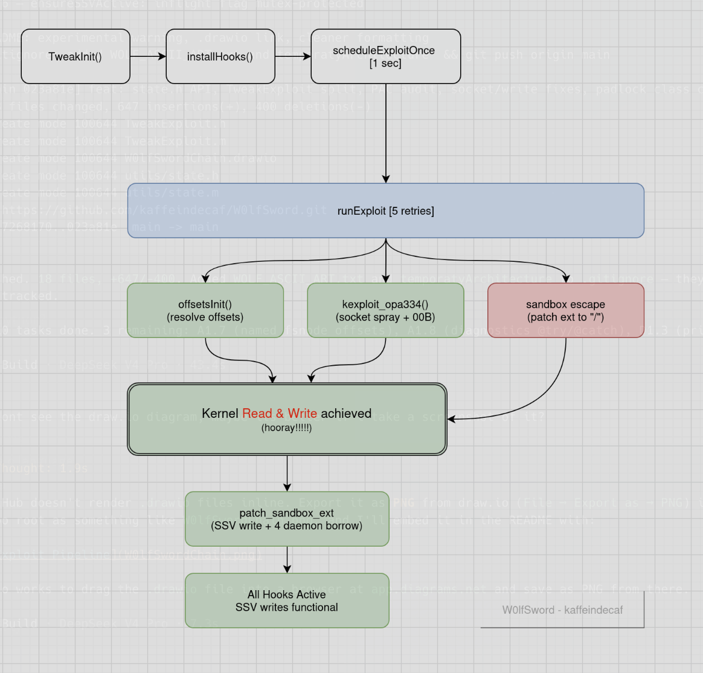

# W0lfSword — iOS Kernel Exploit Toolkit

> **WARNING: EXTREMELY EXPERIMENTAL — NO REAL DEVICE TESTING HAS BEEN PERFORMED.**  
> This code has never been run on a physical iOS device. Kernel panics, data loss,  
> and permanent filesystem corruption are expected. Use only on a dedicated test device  
> you are willing to restore via DFU. **Do NOT install on a daily-driver device.**

> Kernel-level sandbox escape + Signed System Volume bypass for iOS 17.0–26.0.1  
> Powered by the **DarkSword** exploit engine — ICMPv6 + IOSurface → kernel R/W  
> Made by **[kaffeindecaf](https://github.com/kaffeindecaf)**

---

## Table of Contents

- [Credits](#credits)
- [Features](#features)
- [Supported Devices](#supported-devices--ios-versions)
- [Project Layout](#project-layout)
- [Architecture](#architecture)
- [Quick Start](#quick-start)
- [CLI & Scripts](#cli--scripts)
- [Build Guide](#build-guide)
- [Installation](#installation)
- [Diagnostics](#diagnostics)
- [Troubleshooting](#troubleshooting)
- [Documentation](#documentation)
- [Known Issues](#known-issues)
- [Contributing](#contributing)
- [License](#license)

---

## Credits

This project builds on the work of many people in the jailbreak community:

| Person                                              | Contribution                                                   |
| --------------------------------------------------- | -------------------------------------------------------------- |
| **[Huy Nguyen](https://github.com/34306/)**         | Original FilzaJailedDS project                                 |
| **[wh1te4ever](https://github.com/wh1te4ever/)**    | DarkSword exploit (ICMPv6 + IOSurface) & XPF offset engine     |
| **[opa334](https://github.com/opa334/)**            | XPF patchfinder, krw primitives, sandbox structures            |
| **[Duy Tran](https://github.com/khanhduytran0/)**   | Sandbox hook token technique                                   |
| **[CrazyMind90](https://github.com/crazymind90/)**  | Sandbox token acquisition via kernel R/W                       |
| **[XEmaz](https://x.com/XEmaz_)**                   | SSV bypass, root chown, padlock/license bypass, zip hooks      |
| **[kaffeindecaf](https://github.com/kaffeindecaf)** | iOS 26.0.1 stability, retry logic, threading, logging, tooling |

> **This repo:** [`kaffeindecaf/W0lfSword`](https://github.com/kaffeindecaf/W0lfSword) — fork of [`34306/FilzaJailedDS`](https://github.com/34306/FilzaJailedDS)  
> **Informed by:** [`felix-pb/kfd`](https://github.com/felix-pb/kfd) (PUAF), [`opa334/TrollStore`](https://github.com/opa334/TrollStore) (CoreTrust), [`opa334/opainject`](https://github.com/opa334/opainject) (ROP injection)

---

## Features

| Feature | Description |
|---------|-------------|
| **Kernel Exploit** | DarkSword (ICMPv6 socket spray + IOSurface OOB) — kernel R/W |
| **Retry Loop** | Up to 5 attempts with exponential backoff |
| **Sandbox Escape** | Walks `proc → ucred → label → sandbox → ext_set`, patches extensions to `"/"` |
| **SSV Bypass** | Vnode data pointer swap — writes to `/System/`, `/usr/`, `/bin/`, `/sbin/` |
| **Root Ownership** | Auto `chown root:wheel` on files created in sealed paths |
| **Root Helper Bypass** | Intercepts `TGRootFileManager` XPC calls — no helper needed |
| **Zip/Unzip** | Uses Filza's minizip via dlsym (13 function pointers validated) |
| **License Bypass** | Suppresses "binary modified" and activation nag alerts |
| **Padlock Bypass** | Hooks `NZFileBrowserController`, `NZFileItem` — always allow edit/delete |
| **Apps Manager Fix** | Filesystem scanner populates app list when LSApplicationWorkspace returns empty |
| **Thread Safety** | `_Atomic bool` with `memory_order_acquire/release` for cross-thread flags |
| **Consolidated Logging** | Single `/tmp/FilzaTweak.log` with 4MB rotation + trylock fallback |
| **Runtime Toggle** | `touch /var/mobile/Documents/.filza_tweak_disable` to disable without uninstalling |
| **Offset Verification** | Thread kstackptr validated against VM bounds before any kernel writes |

---

## Supported Devices & iOS Versions

| iOS Version | A12-A14 | A15 (SE3, 13) | A16 (14 Pro) | A17 (15 Pro) | A18 (16) | M1-M4 |
| ----------- | ------- | ------------- | ------------ | ------------ | -------- | ----- |
| 17.0–17.7   | ✓       | ✓             | ✓            | ✓            | —        | ✓     |
| 18.0–18.7.7 | ✓       | ✓             | ✓            | ✓            | ✓        | ✓     |
| 26.0–26.0.1 | ✓       | ✓             | ✓            | ✓            | ✓        | ✓     |

**Not supported:** iPhone 17 series (A19), iPad M5 — Apple added MTE (Memory Tagging Extension) which blocks kernel R/W.

---

## Project Layout

```
W0lfSword/
├── Tweak.m                          # Main orchestrator (1185 lines)
├── sandbox_escape.h / .m            # Sandbox escape via kernel extension patching
├── FilzaPadlockBypass.h / .xm       # Filza UI padlock bypass (Logos hooks)
│
├── kexploit/                        # Kernel Exploit Engine (32 files)
│   ├── kexploit_opa334.h / .m       # DarkSword: ICMPv6 spray + IOSurface OOB
│   ├── krw.h / .m                   # kread64/kwrite64/kreadbuf post-exploit primitives
│   ├── kutils.h / .m                # proc/task/thread lookup, AMFI, label accessors
│   ├── offsets.h / .m               # Per-iOS-version kernel struct offset table
│   ├── sandbox.h / .m               # Extension patching + multi-daemon borrow fallback
│   ├── vnode.h / .m                 # Vnode redirection, child lookup, hide/reveal
│   ├── file.h / .m                  # File overwrite via vnode data pointer swap
│   ├── PAC.h / .m / xpaci.h         # Pointer Authentication Code stripping (arm64e)
│   ├── VM.h / .m                    # Kernel VM map entry/object manipulation
│   ├── Thread.h / .m                # Remote thread state + guard exception injection
│   ├── Exception.h / .m             # Mach exception port + reply construction
│   ├── RemoteCall.h / .m            # Remote function calling via thread hijack + gadgets
│   ├── MigFilterBypassThread.h / .m  # MIG sandbox filter bypass
│   ├── sandbox_backup.m             # Backup/restore sandbox state
│   ├── vnode_research.h / .m         # APFS fsnode structure dump
│   ├── apfs_fsnode.h                # Full reverse-engineered APFS inode struct (570 lines)
│   └── machine_info.h               # CPU family constants (A8 through A18 Pro + M1-M4)
│
├── SSV/                             # Signed System Volume Bypass
│   └── SSVUtils.h / .m              # Temp → vnode redirect → write → chown root:wheel
│
├── utils/                           # Utilities
│   ├── tweak_log.h                  # Consolidated logging (mutex, trylock, 4MB rotation)
│   ├── permission_utils.h / .m      # Kernel-level chown/chmod via fsnode patching
│   ├── file.h / .c                  # File hide/reveal via VISSHADOW vnode flag
│   ├── hexdump.h / .c              # Hex dump output for debugging
│   └── process.h / .c              # Process crash/watch, ASLR toggle
│
├── kpf/                             # Kernel Patchfinder
│   └── patchfinder.h / .m          # Extract kernelcache → initialize XPF offset engine
│
├── XPF/                             # XPF Offset Patchfinder
│   ├── src/                         # Core (12 files): xpf, common, decompress, bad_recovery, non_ppl, ppl
│   └── external/ChOma/src/         # Mach-O + dyld cache parser (34 files)
│
├── research/                        # Reverse-engineered struct definitions
│   └── sandbox_research.h          # Kernel sandbox_label, extension_set, extension structs
│
├── scripts & docs
│   ├── W0lfSword                     # Project CLI — 12 commands (build, deploy, audit, status, log...)
│   ├── W0lfSword-Beta                # Interactive exploit menu — superset of W0lfSword
│   ├── build_and_extract.sh          # Build + auto-extract .dylib
│   ├── Makefile                      # Theos build system (iphone:clang:latest:15.0, arm64)
│   ├── control                      # Debian package metadata (v0.7.6)
│   ├── FilzaApplySandboxExt.plist   # MobileSubstrate filter (bundle: com.tigisoftware.Filza)
│   ├── README.md                    # This file
│   ├── CONTEXT.md                   # Full project knowledge base for AI session resumption
│   ├── AUDIT_REPORT.md              # 20 findings + 11 fixes applied + PR guide
│   ├── BUG_BOUNTY.md                # 14 security findings with Apple bounty ranges
│   ├── DEBUG_TRACKING.md            # Every log statement mapped by file:line + strip guide
│   ├── ROADMAP.md                   # 115-item checklist for features, bugs, research
│   └── BUILD.md                     # Theos explanation + build instructions + troubleshooting
│
├── .theos/                          # Theos build artifacts (auto-generated)
└── packages/                        # Pre-built .deb packages
```

**Total:** 68 source files (.h/.m/.xm/.c) + 8 documentation files.

---

## Architecture

```
┌─────────────────────────────────────────────────────────────────┐
│                    Filza App (com.tigisoftware.Filza)            │
│                                                                 │
│  ┌───────────────────────────────────────────────────────────┐  │
│  │               FilzaApplySandboxExt.dylib                   │  │
│  │          (MobileSubstrate — injected at load time)         │  │
│  │                                                            │  │
│  │  ┌─────────────┐  ┌──────────────┐  ┌────────────────┐    │  │
│  │  │  Tweak.m    │  │ PadlockBypass│  │  SSVUtils      │    │  │
│  │  │ (orchestrator)│  │ (.xm hooks) │  │ (vnode redirect)│   │  │
│  │  └──────┬──────┘  └──────────────┘  └───────┬────────┘    │  │
│  │         │                                    │             │  │
│  │  ┌──────▼──────────────────────────────────▼─────────┐     │  │
│  │  │                kexploit/                           │     │  │
│  │  │  ┌───────────┐  ┌───────┐  ┌─────────────────┐    │     │  │
│  │  │  │ DarkSword │→ │ krw   │→ │ sandbox ext patch│   │     │  │
│  │  │  │ ICMPv6+IO │  │(kread │  │ borrow_sandbox  │    │     │  │
│  │  │  │  surface  │  │ kwrite)│  │ (4-daemon fallback)│  │     │  │
│  │  │  └───────────┘  └───────┘  └─────────────────┘    │     │  │
│  │  │  ┌────────────────────────────────────────┐       │     │  │
│  │  │  │  XPF + ChOma (dynamic offset resolution)│      │     │  │
│  │  │  │  kernelcache → decompress → parse      │       │     │  │
│  │  │  │  → pattern match → struct offsets      │       │     │  │
│  │  │  └────────────────────────────────────────┘       │     │  │
│  │  └──────────────────────────────────────────────────┘     │  │
│  └───────────────────────────────────────────────────────────┘  │
└─────────────────────────────────────────────────────────────────┘
```

### Exploit Pipeline



```
TweakInit() → installHooks() → scheduleExploitOnce() [1s delay]
→ runExploit() [5 retries, exponential backoff]
  → offsets_init()          [resolve kernel struct offsets]
  → kexploit_opa334()       [socket spray + OOB race → kernel R/W]
  → sandbox_escape()        [walk proc→sandbox ext table, patch to "/"]
  → patch_sandbox_ext()     [SSV write activation, 4-daemon borrow fallback]
→ All hooks active, SSV writes functional
→ thread kstackptr verified against VM_MIN/VM_MAX before writes
```

---

## Quick Start

```bash
git clone https://github.com/kaffeindecaf/W0lfSword.git
cd W0lfSword

./W0lfSword doctor          # Check build environment
./W0lfSword build           # Compile the tweak
./W0lfSword deploy 192.168.1.5  # Install on device
./W0lfSword log             # Watch live logs
./W0lfSword status          # Project health overview
./W0lfSword audit           # Run static analysis
```

---

## CLI & Scripts

### `W0lfSword` — Project CLI

```
╔══════════════════════════════╗
║  W0lfSword                   ║
║  iOS Kernel Exploit Toolkit  ║
╚══════════════════════════════╝

Usage: ./W0lfSword <command> [args...]
```

| Command          | Description                                                   | Example                          |
| ---------------- | ------------------------------------------------------------- | -------------------------------- |
| `build`          | Compile tweak + create .deb                                   | `./W0lfSword build`              |
| `extract`        | Extract .dylib from built .deb                                | `./W0lfSword extract`            |
| `deploy <ip>`    | scp .deb → dpkg -i → killall Filza on device                  | `./W0lfSword deploy 192.168.1.5` |
| `status`         | Project health: git, build, ROADMAP progress                  | `./W0lfSword status`             |
| `audit`          | Static analysis: brace balance, printf count, offset coverage | `./W0lfSword audit`              |
| `log [n]`        | Fetch last n lines of `/tmp/FilzaTweak.log` from device       | `./W0lfSword log 100`            |
| `toggle on\|off` | Enable/disable tweak on device via flag file                  | `./W0lfSword toggle off`         |
| `offsets [ver]`  | Show offset table coverage per iOS version                    | `./W0lfSword offsets 26.0`       |
| `clean`          | Clean build artifacts + temp files                            | `./W0lfSword clean`              |
| `doctor`         | Check environment: THEOS, SDK, ssh, dpkg, clang, device       | `./W0lfSword doctor`             |
| `targets`        | Show all supported apps + exploit techniques                  | `./W0lfSword targets`            |
| `help`           | Show this reference                                           | `./W0lfSword help`               |

**Device IP configuration:** Run `./W0lfSword deploy <ip>` once to save the IP. Subsequent `log`, `toggle`, and `deploy` commands will use the saved IP automatically. The IP is stored in `.device_ip` (gitignored).

**Color-coded log output:** The `log` command color-codes lines by severity — green for success/SANDBOX ESCAPED, red for errors/failures, yellow for warnings/retries, cyan for structural logs, dim for detail.

### `W0lfSword-Beta` — Interactive Exploit Menu

W0lfSword-Beta is a **superset** of W0lfSword. It includes every original command unchanged, plus an interactive exploit menu when run with no arguments.

```

                         .d$$b
                       .' TO$;\
                      /  : TP._;
                     / _.;  :Tb|
                    /   /   ;j$j
                _.-"       d$$$$
              .' ..       d$$$$;
             /  /P'      d$$$$P. |\
            /   "      .d$$$P' |\^"l
          .'           `T$P^"""""  :
      ._.'      _.'                ;
   `-.-".-'-' ._.       _.-"    .-"
 `.-" _____  ._              .-"
-.(g$$$$$$$b.              .'
  ""^^T$$$P^)            .(:
    _/  -"  /.'         /:/;
 ._.'-'`-'  ")/         /;/;
`-.-"..--""   " /         /  ;
.-" ..--""        -'          :
..--""--.-"         (\      .-(\
  ..--""              `-\(\/;`
    _.                      :
                            ;`-
                           :\
                           ;

  W0lfSword-Beta  iOS Exploit Menu
  DarkSword Engine — Made by kaffeindecaf
```

```bash
./W0lfSword-Beta                 # Interactive menu (no args)
./W0lfSword-Beta quick           # One-shot: build → deploy → verify
./W0lfSword-Beta profile save    # Save current exploit config
./W0lfSword-Beta device add      # Add/manage test devices
./W0lfSword-Beta monitor         # Real-time log viewer
./W0lfSword-Beta history stats   # Exploit success rate dashboard
./W0lfSword-Beta build           # All original W0lfSword commands work too
```

**Interactive Menu:**

```
  [1] Quick Exploit      Build → Deploy → Verify
  [2] Deploy Only        Install on device
  [3] Device Manager     Add/switch devices
  [4] Live Monitor       Real-time log viewer
  [5] Profiles           Save/load configs
  [6] History            Exploit stats
  [7] Diagnostics        Doctor, audit, status
  [8] Targets            Supported apps
  [q] Quit
```

**New Beta-only commands:**

| Command               | Description                                                                        |
| --------------------- | ---------------------------------------------------------------------------------- |
| `quick`               | One-command exploit chain: builds, deploys, waits for exploit, verifies log output |
| `profile save <name>` | Save current device/target/retry settings as a named profile                       |
| `profile load <name>` | Load a saved profile                                                               |
| `profile list`        | Show all profiles with colored status                                              |
| `device add <ip>`     | Add a test device to the manager                                                   |
| `device list`         | Show all devices with ping status                                                  |
| `device switch <ip>`  | Switch active device                                                               |
| `device info [ip]`    | Show iOS version, model, kernel version of device                                  |
| `monitor`             | Real-time `tail -f` of device log with color coding                                |
| `history`             | Show exploit attempt log with timestamps                                           |
| `history stats`       | Dashboard: total attempts, success rate %, ASCII bar chart                         |

Data stored in `.w0lfsword/` directory (profiles, devices, history — gitignored).

### `build_and_extract.sh`

```bash
./build_and_extract.sh              # Build then extract .dylib to project root
./build_and_extract.sh --keep-temp  # Keep the extraction directory for inspection
```

Compiles the tweak via Theos, unpacks the resulting `.deb`, copies `FilzaApplySandboxExt.dylib` to the project root, and prints file type + linked libraries. Made by kaffeindecaf.

---

## Build Guide

### What is Theos?

**Theos** is a cross-platform build system for iOS tweak development. It:

1. **Cross-compiles** Objective-C/C/C++/Logos code for iOS (arm64/arm64e)
2. **Links** against iOS SDKs (UIKit, IOKit, IOSurface, etc.)
3. **Packages** the compiled dylib + plist into a `.deb` for jailbroken devices
4. **Preprocesses Logos** — `.xm` files with `%hook`/`%orig`/`%log` syntax become MobileSubstrate hook code

### Prerequisites

**macOS:**

```bash
xcode-select --install
bash -c "$(curl -fsSL https://raw.githubusercontent.com/theos/theos/master/bin/install-theos)"
echo 'export THEOS=~/theos' >> ~/.zshrc && source ~/.zshrc
brew install dpkg
```

**Linux:**

```bash
bash -c "$(curl -fsSL https://raw.githubusercontent.com/theos/theos/master/bin/install-theos)"
echo 'export THEOS=~/theos' >> ~/.bashrc && source ~/.bashrc
# Get iOS SDK from: https://github.com/theos/sdks (place in $THEOS/sdks/)
sudo apt install dpkg fakeroot clang lld
```

### Build

```bash
# Full build + package
make package

# Build only (no .deb)
make

# Build for release (strips debug symbols)
make package FINALPACKAGE=1

# Clean
make clean
```

---

## Installation

```bash
# Option A: Using the CLI (recommended)
./W0lfSword build && ./W0lfSword deploy 192.168.1.5

# Option B: Manual
scp packages/com.local.filzaescaped_*.deb root@<device-ip>:/tmp/
ssh root@<device-ip> "dpkg -i /tmp/com.local.filzaescaped_*.deb && killall -9 Filza"
```

The tweak injects into `com.tigisoftware.Filza` via MobileSubstrate. Restart Filza — the exploit runs automatically within 1-2 seconds.

### What gets installed

```
/Library/MobileSubstrate/DynamicLibraries/
├── FilzaApplySandboxExt.dylib     # The compiled tweak (~540KB, arm64)
└── FilzaApplySandboxExt.plist     # Filter: inject only into Filza
```

---

## Diagnostics

### Log file

All logs go to a single file inside Filza's sandbox:

```
/tmp/FilzaTweak.log        # Main log (4MB max, rotates to .old on overflow)
```

Fetch it from your computer:

```bash
./W0lfSword log        # Last 50 lines
./W0lfSword log 200    # Last 200 lines
```

### What a successful log looks like

```
=== TWEAK LOADED ===
[Tweak] TweakInit started
[Hooks] All hooks installed
[Tweak] Sandbox not yet escaped
[Tweak] Exploit attempt #1...
[Tweak] kexploit succeeded
[SBX] *** SANDBOX ESCAPED (R+W) — 3/3 tests passed ***
[SSV] patch_sandbox_ext succeeded
[SSV] check_sandbox_var_rw result r=0 w=0
[SSV] ensureSSVActive set active=1
```

### Debug UI Bypass

To force Filza's UI to show all files as writable (even without kernel support):

```bash
# Enable (dangerous — UI lies about write success)
touch /var/mobile/Documents/ui_debug_bypass_on.flag

# Disable (default — safe, production mode)
touch /var/mobile/Documents/ui_debug_bypass_off.flag
```

---

## Troubleshooting

### Build Issues

| Symptom                                       | Cause                                          | Fix                                                                                |
| --------------------------------------------- | ---------------------------------------------- | ---------------------------------------------------------------------------------- |
| `theos/makefiles/common.mk: No such file`     | THEOS not set                                  | `export THEOS=~/theos`                                                             |
| `iPhoneOS.sdk not found`                      | Missing SDK                                    | Download from [theos/sdks](https://github.com/theos/sdks), place in `$THEOS/sdks/` |
| `dpkg-deb: command not found`                 | dpkg missing                                   | `brew install dpkg` (macOS) / `apt install dpkg` (Linux)                           |
| `Undefined symbols for architecture arm64`    | Missing framework/library                      | Check Makefile `_FRAMEWORKS` / `_LIBRARIES`                                        |
| `clang: error: no such file: 'XPF/src/xpf.c'` | XPF submodule not initialized                  | `git submodule update --init`                                                      |
| Warning spam during build                     | Normal — the Makefile suppresses most warnings | Intended: `-Wno-unused-function` etc. in CFLAGS                                    |

### Runtime Issues

| Symptom                                           | Cause                                   | Fix                                                                                 |
| ------------------------------------------------- | --------------------------------------- | ----------------------------------------------------------------------------------- |
| Filza crashes on launch                           | Exploit panicked kernel on previous run | Wait for reboot, try again (retry loop handles this)                                |
| "Sandbox not yet escaped" repeats 5 times         | Wrong offsets for this iOS build        | Run `./W0lfSword offsets` to check coverage; add new offsets block                  |
| Files in /System show as writable but writes fail | SSV activation failed                   | Check log for `ensureSSVActive set active=1` — if missing, kernel patch failed      |
| `check_sandbox_var_rw FAILED`                     | Extension patching didn't take effect   | Retry loop handles this; check if `borrow_sandbox_ext` was tried as fallback        |
| `g_ui_debug_bypass` simulated writes              | UI debug is ON                          | Run `touch /var/mobile/Documents/ui_debug_bypass_off.flag` and restart Filza        |
| Tweak does nothing                                | Disabled by flag file                   | Run `./W0lfSword toggle off` or `ssh rm /var/mobile/Documents/.filza_tweak_disable` |
| `thread kstackptr outside valid range`            | Wrong offsets for this SoC/iOS combo    | Add per-SoC offset overrides in offsets.m for your device                           |
| Filza 4.0.2 crashes                               | Known incompatibility                   | Use Filza 4.0.0                                                                     |

### Device Issues

| Symptom                                                | Cause                                 | Fix                                                   |
| ------------------------------------------------------ | ------------------------------------- | ----------------------------------------------------- |
| `ssh: connect to host ... port 22: Connection refused` | OpenSSH not installed on device       | Install OpenSSH via Sileo/Cydia                       |
| `Permission denied (publickey)`                        | SSH key mismatch                      | `ssh -o StrictHostKeyChecking=no root@<ip>`           |
| Device not discoverable                                | Different network                     | Check device Wi-Fi IP in Settings → Wi-Fi → (i) icon  |
| `dpkg: error processing package`                       | Already installed or version conflict | `ssh root@<ip> "dpkg --force-depends -i /tmp/...deb"` |

---

## Documentation

| File | Purpose |
|------|---------|
| `CONTEXT.md` | Full project knowledge base — start here when resuming a session |
| `ROADMAP.md` | 115-item checklist: bugs, features, exploits, bug bounty, testing |
| `BUG_BOUNTY.md` | 14 security findings with Apple bounty ranges ($25K–$250K) |
| `AUDIT_REPORT.md` | 20 findings ranked CRITICAL→LOW, 13 fixes applied, PR guide |
| `DEBUG_TRACKING.md` | Every log statement mapped by file:line, 3-layer strip guide |
| `BUILD.md` | Theos explanation, prerequisites, build commands, troubleshooting |

---

## Known Issues

- **Exploit may take 2-3 attempts** — the retry loop handles this automatically (up to 5 attempts)
- **Padlock bypass may not work** on all Filza versions — hooks target specific class names that could differ
- **Filza v4.0.2 reportedly causes crashes** — use v4.0.0
- **SSV writes are best-effort** — the kernel patch may not activate on first file operation
- **iPhone 17 / M5 will not work** due to Apple's MTE (Memory Tagging Extension)

---

## Contributing

Found a bug? Open an issue. Want to add support for a new iOS version or device?

1. Get the kernelcache from the target device
2. Run XPF on it to resolve new offsets
3. Add a new `SYSTEM_VERSION_GREATER_THAN_OR_EQUAL_TO` block in `kexploit/offsets.m`
4. Test on real hardware
5. Submit a PR

See `ROADMAP.md` for the full task list. See `AUDIT_REPORT.md` for remaining medium/low items.

Before committing, run:

```bash
./W0lfSword audit    # Check braces, printf count, offset coverage
./W0lfSword status   # Verify nothing in dirty state
```

---

## License

This project incorporates code from multiple open-source projects:

- DarkSword kernel exploit (wh1te4ever)
- XPF offset engine / sandbox structures (opa334)
- ChOma Mach-O parser

All original code remains under the licenses of their respective authors.  
The integration layer and tooling are released as-is for research and testing.

**WARNING:** This is a pre-release testing build. Modifying system files can render your device unbootable — use at your own risk.
